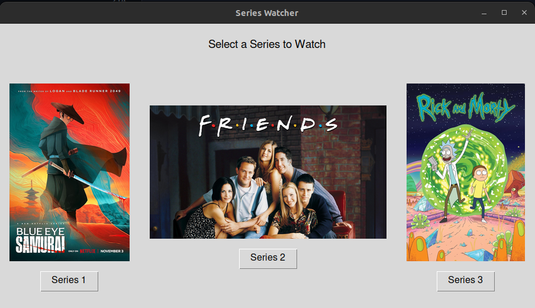

# Series Watcher



Series Watcher is a Python application that simulates a streaming service by allowing you to watch your series episodes continuously. It automatically remembers where you left off, including the exact second of the episode. It also supports browsing for a series folder, renaming episodes, displaying images, and selecting subtitles.

## Features

- **Automatic Episode Playback**: Continues from where you left off and automatically plays the next episode.
- **Episode Renaming**: Automatically renames episodes to a consistent format.
- **Playback Controls**: Pause, play, fast forward, rewind, next episode, and previous episode.
- **Skip Time Setting**: Set custom skip time for fast forward and rewind.
- **Subtitle Selection**: Choose from available embedded subtitles.
- **Image Display**: Displays an image from the series folder if available.
- **JSON State Saving**: Saves the current state (season, episode, playback time, and root folder) to a JSON file.
- **Modern UI**: User-friendly and visually appealing interface.

## Requirements

- Python 3.9 or higher
- `python-vlc` package
- `tkinter` package
- `Pillow` package

## Installation

1. **Clone the repository**:

   ```bash
   git clone https://github.com/ShendoxParadox/series_playback_player.git
   cd series-watcher

2. **Create and activate a virtual environment (optional but recommended)**:
   ```bash
   python3 -m venv venv
   source venv/bin/activate


3. **Install the dependencies**:
   ```bash
   pip install python-vlc pillow

## Usage
**Run the application**:
   ```bash
   python watch_series.py
   ```

**Browse for your series folder**:
Click on the Browse button and select the root folder of your series.

**Control Playback**:
Use the buttons to play, pause, fast forward, rewind, and navigate between episodes.

**Set Skip Time**:
Enter the skip time in seconds and click on Set Skip Time.

**Select Subtitles**:
If available, select subtitles from the dropdown.

**Delete Last Position**:
Use the Delete Last Position button to reset the saved state.

**Screenshots**
Main Screen with Playback Controls

Subtitle Selection Dropdown

**Contributing**
Contributions are welcome! Please fork the repository and submit a pull request.

**License**
This project is licensed under the MIT License. See the LICENSE file for details.

**Acknowledgements**
VLC Python Bindings
Pillow
Contact
For any questions or suggestions, feel free to reach out to the repo owner.

**Happy Watching!**

